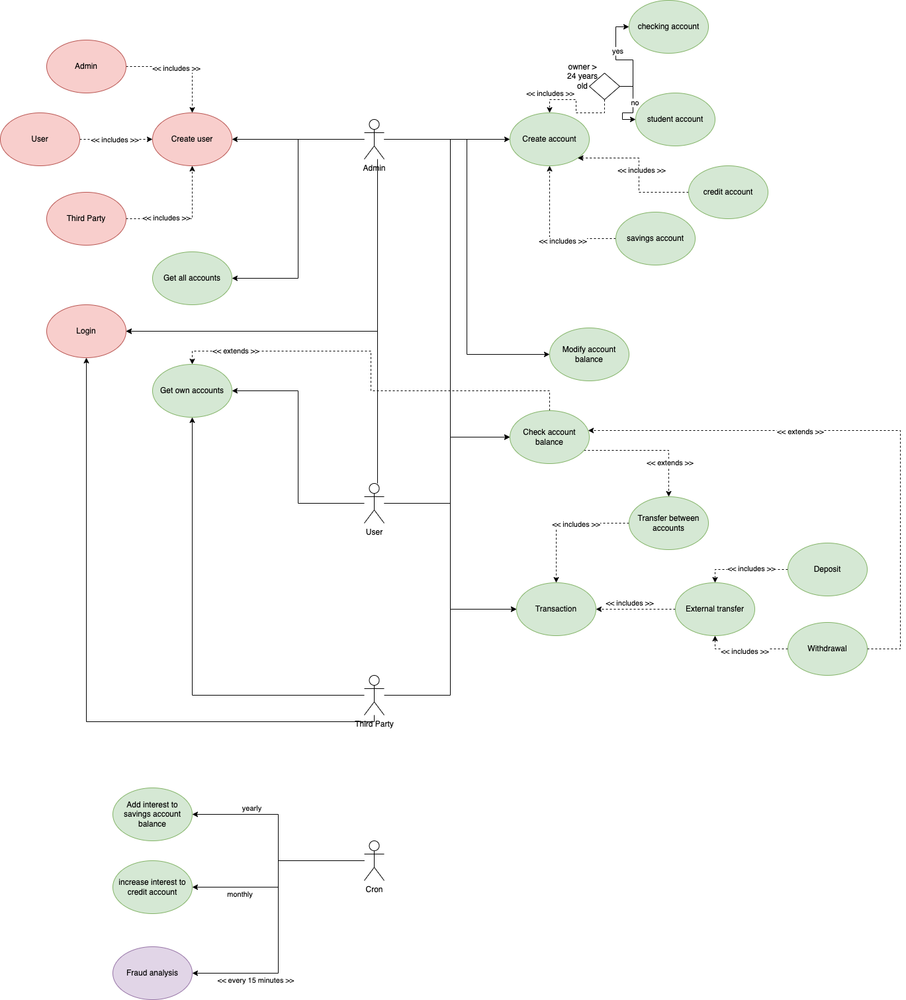
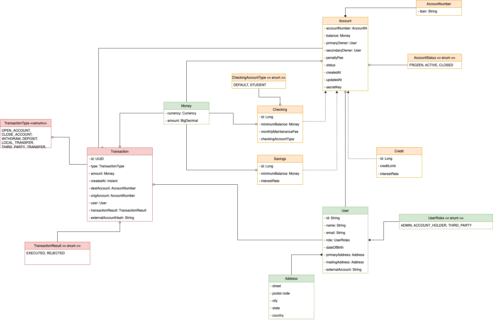
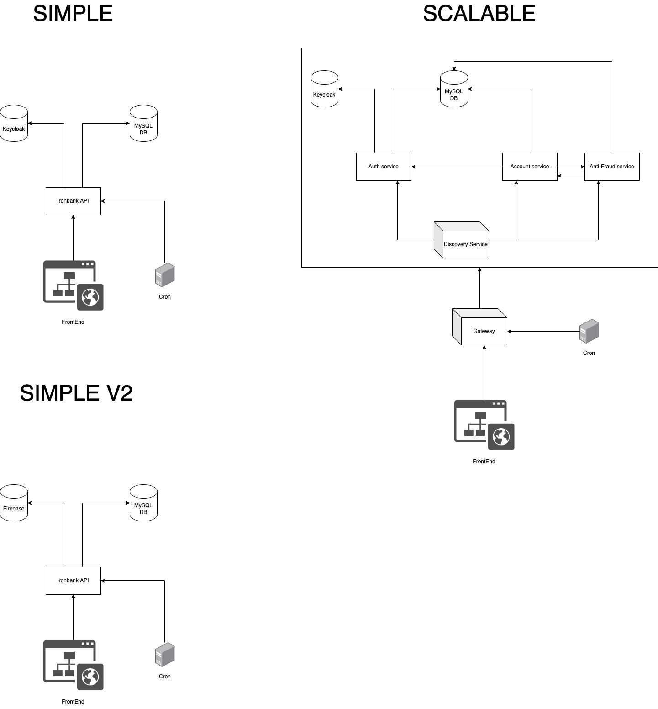

# Ironhack J3-PT-Java-Bootcamp - FINAL PROJECT

## Setup

### Docker Setup

1. Get a Firebase private key file -> <https://firebase.google.com/docs/admin/setup#initialize-sdk>
2. Put it on `ironbank-api/resources/` as `firebase-private-key.json`
3. Configure database credentials on the `docker-compose.yml` file
4. Configure database credentials on the `src/main/resources/application.properties`
5. Create a `firebase.properties` file on `src/main/resources/` based on `src/main/resources/firebase.properties.example` with the `api_key` filled in.

### Setup the old fashioned way

1. You must have a running `mysql` instance
2. Configure database credentials on the `src/main/resources/application.properties`
3. Get a Firebase private key file -> <https://firebase.google.com/docs/admin/setup#initialize-sdk>
4. Put it on `resources/` as `firebase-private-key.json`
5. Create a `firebase.properties` file on `src/main/resources/` based on `src/main/resources/firebase.properties.example` with the `api_key` filled in.

### One more thing

- The user you use should have all `CRUD` permissions

### Startup (with Docker)

You only need to do a `docker compose up -d` on the root folder.

### Startup (without Docker)

Right now there are no releases, so you must open it in your IDE of your choice and start it up as any other spring boot project

And after startup:

- The API will be available on <http://localhost:8081>
- The OpenAPI schema is available on <http://localhost:8081/docs/api>
- The Swagger UI to test and see the OpenAPI schema is available on <http://localhost:8081/docs/swagger-ui/index.html>

## Documentation

### Use Case Diagram

### Class Diagram

### System diagram

